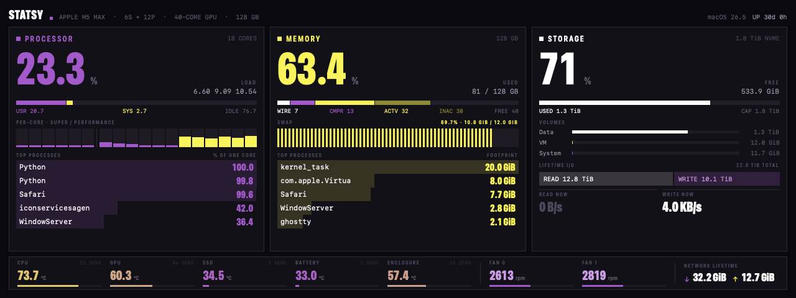
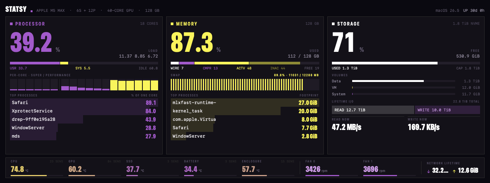
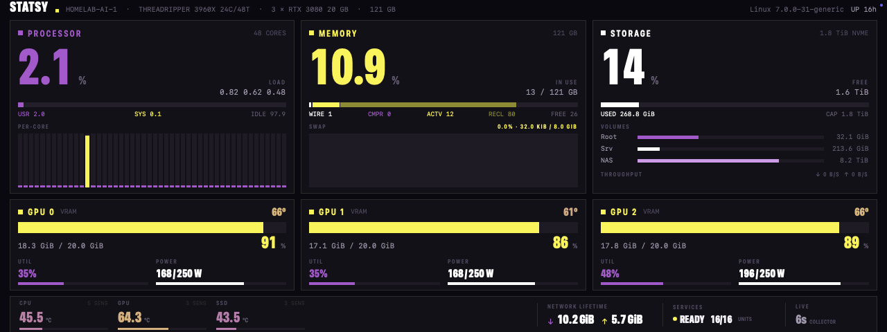

# Statsy

A system monitor for a small secondary display: CPU, memory and storage, each
above its five heaviest processes, over a strip of temperature and fan readings.



It targets a 7-inch 1280x480 panel running at 1:1 scale with no HiDPI backing.
At roughly 195 PPI text renders at about 56% of its usual physical size, which
is why the type is larger than it would be in a normal app.

The same panel with all 18 cores saturated and a load average of 44:



## Running

```bash
swift build && swift test
./make-app.sh
open '.build/Statsy Menu.app'
```

Statsy has no Dock icon and no menu bar entry. It puts a borderless window on
whichever display measures 1280x480 and re-seats itself when the display
arrangement changes.

With no such display attached it shows nothing and samples nothing, so undocking parks it rather than dropping a 1280x480 always-on-top window onto the laptop screen. Redocking brings it back.

`make-app.sh` also builds Statsy Menu.app, a menu bar item that starts and stops the panel and shows which state it is in — the panel itself has no UI to quit from. Keep the two bundles in the same folder: the controller looks for the panel beside itself before it asks Launch Services or checks `/Applications`.

To check the sampling layer without the UI:

```bash
swift run statsy-probe
```

That prints one snapshot in a form you can compare directly against `top`, `df`, `netstat -ib` and `smc`. To see a layout without the display attached:

```bash
swift run Statsy --render panel.png
```

A remote target's layout renders the same way from a captured scrape, with no host attached:

```bash
swift run Statsy --render panel.png --target strix --fixture Tests/StatsyKitTests/Fixtures/strix.prom
```

## Targets

The menu bar item picks which machine the panel shows. The default is this Mac. The other is `homelab-ai-1`, a Threadripper with three RTX 3080s that serves a 27B model, where the reading worth watching is how much VRAM is left.



The third is `strix`, a Strix Halo whose GPU serves a model out of system
memory. Nothing in `/proc/meminfo` sees that memory, so its pane carries a
GPU segment in the memory bar and its lone card reads the shared pool (GTT)
rather than VRAM.

Switching takes effect on a running panel without restarting it. A remote target has no process telemetry, so the lower half of each column has no process lists to show; on a host that publishes GPU figures that space becomes a band of GPU cards, and the ribbon carries unit and endpoint health in place of fan speeds.

Readings come from that host's node_exporter, scraped through an `ssh -L` forward. The host admits port 9100 from its operations server alone, and the forward means that does not have to change: no new listener, no firewall rule and no credential inside the app. The key is ssh's business.

Two cadences land on the same screen. Everything node_exporter reads is current as of the scrape; GPU, NVMe, unit and endpoint figures come from a collector on a one-minute timer, and the ribbon shows that age rather than implying otherwise. If the host goes away the panel says so and ages the last reading rather than holding a stale number that still looks live.

## Where the numbers come from

On this Mac:

| Reading | Source |
| --- | --- |
| CPU, per core and aggregate | `host_processor_info(PROCESSOR_CPU_LOAD_INFO)` |
| Load average | `getloadavg` |
| Core clusters | `hw.perflevelN.*` |
| Memory | `host_statistics64(HOST_VM_INFO64)` |
| Swap | `vm.swapusage` |
| Capacity, whole device | `getmntinfo` |
| Capacity, per volume | `getattrlist(ATTR_VOL_SPACEUSED)` |
| Disk throughput | IOKit, `IOBlockStorageDriver` statistics |
| Temperatures and fans | IOKit, `AppleSMC` |
| Network | IF-MIB, `IFMIB_IFDATA` |
| Processes | a streamed `/usr/bin/top` |
| Uptime | `kern.boottime` |

Five of those are not the obvious API, because the obvious API is wrong.

A remote target reads all of it from node_exporter instead, with GPU, NVMe and service figures coming from the homelab fleet collector's textfile. The panel maps those onto the same `Snapshot` the local samplers produce, so nothing above the sampling layer knows which machine it is drawing.

The memory headline is pressure-oriented rather than a copy of `top`'s "used"
total. It reports active + wired + compressed as **in use** and shows inactive
pages separately as **reclaimable**. On a representative sample that means a
70 GB in-use headline plus 44 GB reclaimable, while `top` combines both into
114 GB used. Free includes both free and speculative pages.

That formula holds on a Linux target too, with each bucket filled from `/proc/meminfo`: anonymous and shared pages as in use, unreclaimable kernel memory as wired, zswap as compressed, page cache as reclaimable. It matters most there, where an 80 GiB model sitting in page cache would otherwise show an idle host at 85% memory.

Process ranking needs `top` because unprivileged libproc cannot see other users'
processes. `proc_pidinfo` and `proc_pid_rusage` return EPERM for about 180 of
1050 processes here, including WindowServer and kernel_task, which are often the
largest consumers. `ps` is no substitute, since its `%CPU` column is a lifetime
average rather than an interval delta.

The SMC request struct has to be exactly 80 bytes. Swift packs later fields into
a nested struct's tail padding, producing a 76-byte request that the SMC answers
with garbage rather than an error. A test pins the layout.

`statfs` cannot tell APFS volumes apart. Every volume in a container reports the
container's block counts, so `/`, `/System/Volumes/Data` and
`/System/Volumes/VM` all compute identical usage. `getattrlist` with
`ATTR_VOL_SPACEUSED` gives per-volume figures that match `df`.

`NET_RT_IFLIST2` wraps at 4 GiB despite declaring 64-bit counters, and reported
27 MB for an interface that had carried 34 GB. The IF-MIB returns real totals.

`docs/sampling.md` has the measurements behind each of these.

## Cost

The panel refreshes at 1 Hz for about 0.2% of one core, plus roughly 1.2% for
its `top` child. Temperatures sample every five seconds instead: reading all 130
SMC sensors takes 17 ms of blocked hardware wait, and they move far more slowly
than that.

A remote target costs 1.4% of one core here and is polled every two seconds rather than every second, because the scrape lands on the machine being measured and the budget applies there as well.

## Palette

The colours are the nonbinary pride flag: purple for CPU, yellow for memory,
white for storage, against a near-black ground. Temperatures ride a
purple-to-yellow ramp between 30 and 90 degrees.

## Requirements

macOS 14 or later, Swift 6. Built and run on 26.5.
